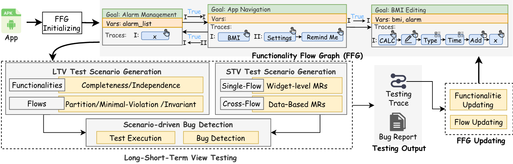

# FuncDroid

FuncDroid is a functionality-oriented mobile GUI testing and exploration tool. Instead of optimizing for traditional coverage metrics alone, it aims to **model app functionalities and their interactions**, then use that model to guide exploration and generate higher-value test cases.

## Motivation

Modern mobile apps evolve quickly and contain many interacting features. In practice, testers still rely heavily on manual, **functionality-oriented** test design because it often finds bugs that coverage-driven exploration misses. Recent research uses large language models (LLMs) to add semantic understanding to GUI testing, but many existing approaches treat a "functionality" as a simple linear event sequence and often test features in isolation - making it hard to uncover deeper bugs caused by **interactions between functionalities**.

FuncDroid addresses this with an inter-functionality, state-aware model and a closed-loop testing workflow.

## Approach (IFO: Inter-Functionality Flow Oriented Testing)

### Overview


### Functionality Flow Graph (FFG)

FuncDroid models an app as a directed **Functionality Flow Graph (FFG)**:
- Each node is a **meaningful functionality**: a complete, user-centric task that is logically indivisible (i.e., it does not contain other meaningful sub-functionalities).
- Each node can be characterized by `(goal, vars, traces)`:
  - `goal`: semantic intent (e.g., "Add alarm")
  - `vars`: state variables used/modified during execution (GUI/data/system-environment dimensions)
  - `traces`: observed execution traces (sequences of widget actions)
- Each edge captures an inter-functionality **flow** annotated with `(pi, phi, pi')`:
  - after executing trace `pi` of functionality `n`, if state condition `phi` holds, then trace `pi'` of functionality `n'` becomes executable
  - `phi` defines a meaningful subset of the app state space, so testing can focus on exploring those state subsets rather than blind exhaustive search

### Iterative, Evidence-Driven Testing Loop

FuncDroid follows an iterative workflow that (1) builds/updates the FFG from execution evidence and (2) generates targeted scenarios to refine the model and find deep interaction bugs:

1) **FFG initializing and updating**
   - Start with lightweight automated exploration to collect initial traces
   - Use an (M)LLM to infer page goals, segment traces into candidate meaningful functionalities, and extract state variables
   - Create initial flows from observed temporal succession (initially setting `phi = True` conservatively), then refine `phi` using new execution evidence
   - Update nodes by merging/splitting/creating functionalities based on semantic coherence and variable usage

2) **Long-short term view scenario testing**
   - Long-term view: generate scenarios to challenge and refine functionality definitions (completeness/independence) and flow preconditions (`phi`) via strategies like repetition, negation, and partition
   - Short-term view: generate metamorphic, data-driven scenarios by transforming GUI/data states at widget-level, intra-functionality, and inter-functionality layers
   - Scenario-driven bug detection: translate scenarios into executable traces, run them adaptively (with recovery), and log evidence for the next update cycle

## What This Repository Contains

- `hmbot/`: core implementation (device control, GUI capture, exploration, graph construction, prompts, utilities).
- `test.py`: minimal entry script that explores the **currently foreground** Android app on a connected device and writes artifacts to `./output/`.
- `Effectiveness evaluation/`, `Usefulness evaluation/`: experiment outputs and datasets (large; not required for running the tool).

## Prerequisites

- Windows/macOS/Linux with **Python 3.9+**
- Android device with **USB debugging enabled**
- `adb` available in PATH (Android platform tools)
- `uiautomator2` environment set up for your device

## Installation

Install dependencies from `requirements.txt`:

```bash
pip install -r requirements.txt
```

Notes:
- `requirements.txt` includes some heavier, optional dependencies (e.g., `torch`, `pandas`) used by certain modules under `hmbot/explorer/`.

## API Key / LLM Configuration

FuncDroid loads LLM settings from environment variables (via `python-dotenv`). Use the provided example file:

1) Copy `.env.example` to `.env`
2) Fill in your endpoint/model/key values

```ini
# Specialized LLM settings 
SPECIALIZED_BASE_URL="https://ark.cn-beijing.volces.com/api/v3/"
SPECIALIZED_MODEL="doubao-seed-1-6-vision-250815"
SPECIALIZED_API_KEY="doubao_api_key"

# General LLM settings 
BASE_URL="openai_url"
MODEL="gpt-4o"
API_KEY=""
```

Then run any Python entrypoint; `python-dotenv` loads `.env` automatically.

## Quick Start

1) Connect your Android device and verify it is visible:

```bash
adb devices
```

2) Choose one of the following:

- **If you have an APK** (FuncDroid will install & launch it for you):

```bash
python test.py --apk "C:\\path\\to\\your.apk"
```

- **If you do not have an APK**: manually open the app you want to test on the device and keep it in the foreground, then run:

```bash
python test.py
```

Artifacts are written to `./output/`.

